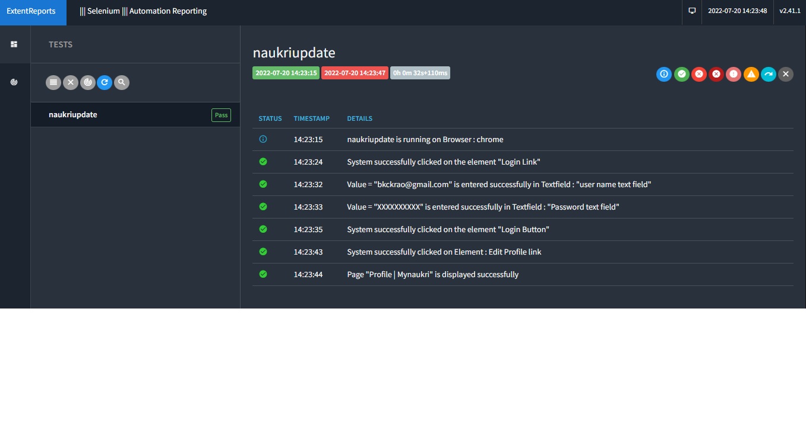

# Automation_framework
====================================================

[Overview](#Overview)

[PageObjects](#Page-Objects)

[How to write page Objects](#How-to-write-page-Objects)

[How to maintain Testdata](#How-to-maintain-Testdata)

[How to write Reporting](#How-to-write-Reporting)

[How to write scripts](#How-to-write-scripts)

[Tools Installation by Script](#Tools-Installation-by-Script)

[Get start with this framework](/Installs/docs/More_On_ckFramework.md)

[Autoit](/Installs/docs/Autoit.md)

[How to use this suite to update the Naukri profile](#How-to-use-this-suite-to-run-the-Naukri-profile)

**Overview:**

Automation Framework is a set of guidelines	and rules used for scripting and controlling the execution of tests  comparison of actual outcomes and expected outcomes. It integrates testdata, object handling and library functions.

**Prerequisite:**
Automation engineer need to have basic knowledge on Java, Xpath.


**DataDrivenFramework:** This is the widely used type of framework. It separates test data from the scripts by which maintenance is easier.

**PageObjectModel:** Each webpage in the application has a corresponding class that holds elements of that webpage. It is maintenance of objects in a class and naming them as corresponding Pages

**Language :** In our Selenium Project we are using Java language. Even though Selenium supports multiple languages, we have chosen Java language just because most of the automation developers have knowledge on Java

**Config.properties** - Global configurations that can be used across the project are placed in this file like Browser, TestdataFile, TimeOutPeriod etc.

**BaseTest**
- This class is responsible for reading the properties file, assigning the values to defined class variables
- Any framework class would like to make use of the members (variables, methods) of this class, needs to extends BaseTest.Java class.
- Webdriver object initializes in this class and traverse through framework classes and then scripts.

**Packages:** We are maintaining different packages for pages and scripts.
For ex: 
- com.CK.ProjectName.pages
- com.CK.ProjectName.Scripts


# Page Objects
## How to write page Objects
Page Object is a Design Pattern which has become popular in test automation for enhancing test maintenance and reducing code duplication. A page object is an object-oriented classes

- Each webpage in the application should have a page object class.
- create a class with reasonable name, For example ck_HomePage.java, ck_LoginPage.java
-  Xpath is the default option and not required to specify. so if the element is not Xpath, it should be declared like type.ID where Type is the Enum.
- All elements should be declared static, Sample below
```
public static Textfield UserName = new Textfield("Username", Type.ID);
public static Textfield Password = new Textfield("Password", Type.ID);
public static Button LoginButton = new  Button("//button[@id = \"btnLogin\"]");
public static Button PageinArabic = new Button("//span[@id='langChange']/i/span[contains(text(), 'English')]");
public static Label Heading = new Label("//h3[contains(text(), 'ck Document Signer')]");
public static SelectBox pagesize = new SelectBox("//select[@id='sdrpPageSize']");
```

# How to write scripts

- Naming convention of script class : **modulename_TS_01_Functionality**
- Every script should extend **FrameLib.java**
- Common functionalities of a module can be created as reusable methods and placed in class file as script_Library
- Variables declaration as sEnglishTitle, where s is the String.
- Class should start with Capital Letter 
- Methods, variables should start with small Letter
Reusable methods of Application can be created with naming **Modulename_Library** and make this as superclass for the script


# How to maintain Testdata
------------------------------------------------------
test data is maintained in Excel sheets 
Testdata file should be placed in the folder **Testdata**
Testdata file name, sheet name should be declared in config.properties

Each script should have the following lines in initialize() to get the names of Testdata file and sheet name, See example below:
- sTestdataFile = getproperty("testdatafile");
- sTestdataSheet = getproperty("testdatasheet");

sample test data creation:
| TestScriptName                        | Username | Password   |
|---------------------------------------|----------|------------|
| ck_TS01_Login_with_Valid_Credentials | ckUser1 | ckpwd1 |
| ck_TS02_Login_with_Invalid_UserName  | Invalid  | ckInvalid1 |
| ck_TS03_Login_with_Invalid_Password  | ckUser1 | Invalidpwd    |

ck_TS01_Login_with_Valid_Credentials - this is the test script name 
Username - this is the field used to get the value 

Excel workbook name should be written in Config.properties
- testdatafile = ck_Testdata.xlsx


**Each test script should have these values**

getdata("Username");

-   Testscript name should be written in first column 
-	You can organize test data in sheets, how ever not required to specify the sheet name. Our framework can identify the Testscript name and get the data
in the testdata sheet that filters the value horizontally, here our framework dynamically captures the method name and assigns to the variable sThisMethod.
-   parameter4 - Username is the column heading in the testdata file that filters text

## Sample of getdata methods.
	System.out.println("user value 2 : " + getdata("Username"));
	System.out.println("user value 3 : " + getdata("Password"));
	

# Reporting
## How to write Reporting

Report generation is built in our automation framework. 
Name of the report can be taken as the class name append with date and time. For ex **ck_Login_03-09-2020_02.03.51**

Each method is considered as one TestScript and report is generated for each script. 
Here we are considering the method name as the script name and the same name has been maintained in testdata sheet and the report.
As an engineer your job is just to write the reporting statements where required. Sample [here](#How-to-write-the-Pass-and-Fail-reports)

## How to write the Pass and Fail reports

we have customized the reporting that can be written in the following ways:

The second boolean parameter represents to take screenshot or not. Screenshot will be displayed in the report as below

```
Reporting.pass("Pass Description");
Reporting.pass("Pass Description", true);
Reporting.fail("Fail Description");
Reporting.fail("Fail Description", true);
Reporting.Info("Information");
Reporting.Info("Information", true); 
```


## Library Functions

Library functions are the methods built in the framework. These methods can be accessed with object *lib*.

*Following are the list of methods:*

- *getTextByXpath(String sXpath)* - To get the label by passing xPath as String

- *isElementPresent(By by)* - It will return false, if element does not present. Similarly return true, if element present

- *waitForElementBy(By by, String ElementName)* - System wait for the presence of element for Timeout number of seconds with an inerval of 5 seconds and throws error

- *waitfortitleandvalidate(String sTitle)* - System waits for page to load until the page Title appears and validates the Title. If the waiting time reaches Timedout number of seconds, throws error

- *maximizethewindow()* - This method will maximize the browser window handled by driver

- deletecookies() - This method will delete the browser cookies

- focustoframes(String OuterFrame, String InnerFrame) - This method will move into two frames one by one

- focustoframes(String Frame) - This method will move into the frame provided in the parameter

- refreshPage() - This method will Refresh the page
- doubleClick(WebElement Element) - To double click on an element provided in the parameter as webelement

- hover(String sXPathofElement) - To hover an element by providing xpath of element

- hovernclick(String hoverelement, By clickelement) - To hover on element and clicking on it

- windowhandle() - This method will switch the driver from one browser to other browser

- outofframes() - To move out of all the frames

- getXpathsCount(String sXpath) - This method is used to get the count of multiple elements that matches the xpath

- clickon(String sXpath, String sElementName) - This method is used to click on an element. Here it uses Javascript executor to identify and click on element using xpath

- clickButtonAndUploadFile(String sButtonXpath, String sFilepath) - This method is used to click on browse button and upload a file

- isElementAbsent(By by) - It verifies the absence of element and returns true or false

- verifyAbsence(String sXpath) - This method verifies the absence of element by taking the xpath and writes in the logs

- verifyPresence(String sXpath) - This method verifies the presence of element by taking the xpath and writes in the logs

- setAttibute(String sXpath, String sAttributeName, String sAttributeValue) - This method is to update the attribute value

- deleteAttribute(String sXpath, String sAttributeName) - This method is to delete the attribute value by passing xPath as parameter

- verifyDomComplete() - This method veries dom is complete or not

- alertAccept() - This method is to click OK on the alert

## Util Functions:

*sleepforseconds(int n)* - This method is used to sleep for number of seconds mentioned in parameter

*pressEscape()* - This method is used to click Escape button

*numberoftabs(int tabscount)* - This method used to click tab button number of times mentioned in parameter

*pressKeys(int KeyEvent)* - This method to press the keyboard keys.
For ex pressKeys(keyEvent.VK_1) , keyEvent.VK_A

*hitenter* - This method will click the Enter button 

*runAutoit(String autoitexepath)* - This method is used to execute the Autoit script

*runAutoit(String autoitexepath, String param1)* - This method is used to execute the Autoit script.
- @param autoitexepath - Path of compiled Autoitscript file with extension .exe
- @param param1 - This is the value of parameter that was declared in the Autoit script

*getCurrentDatenTime(String format)* - This method will return the current date and time in the format specified in parameter.

*getTomorrowDatenTime(String format)* - This method will return the tomorrow date and time in the format specified in parameter

*getYesterdayDatenTime(String format)* - This method will return the yesterday date and time in the format specified in parameter

*getformat()* - This method just returns the format predefined in this class

*createFolder(String sPath)* - this method look for the folder and creates if not found in the specified path

*renameFolder(String CurrentName, String NewName)* - This method will rename the file/folder by providing both old and new name parameters. Please note that, If you want to rename the file, it should have extensions as well

*deleteFolder(String Path)* - This method will delete the file/folder specified as parameter. Here we have to pass the complete path of the file or folder.

**Tools Installation by Script:**

- Download the GitHub repository provided to your project
- Go to **Installs** folder
- Double click the Batch file **Enable_To_Run.bat**
- Run the file **Run_Installations** in Administrator Powershell and provide your options for the softwares:


		
		Do you want to install Eclipse ? (Y/N)

		Do you want to install OpenJDk	? (Y/N)

		Do you want to install Git	? (Y/N)


**Manual Installations:**

- *Eclipse*  : Eclipse can be downloaded from the [link](https://www.eclipse.org/downloads/packages/release/2018-09/r/eclipse-ide-java-ee-developers)
- *Java*   : Copy the folder Installs to the local and run the Install_Openjdk.ps1 in Elevated shell.
- *TestNG* : This can be handled with pom.xml
- *Extent* : This can be handled with pom.xml
- *Git*	   : Copy the folder from docs/Scripts to the local folder and run the Install_Git.ps1 in Elevated shell.


# How to use this suite to update the Naukri profile 

we have created a sample suite to make use of our ckSelenium framework and also make you understand better.

### Steps to upload your CV in Naukri using this suite

 - Enter your username, password of Naukri in the excel sheet(named Naukri_test_data) which is placed in Testdata folder.
 - Copy your cv in the same Testdata folder
 - Copy the name of your cv and place the same name in below line of Naukri.java (in **src\main\java\com\Bachu\Scripts\Naukri.java**)

		private String filename = "CK_Devops_Testing.docx";

Right click on Project --> Run as --> Maven Install
